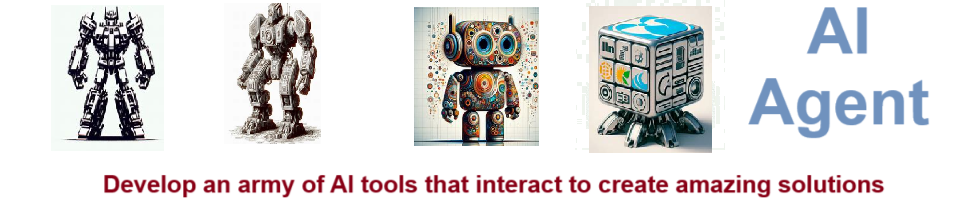
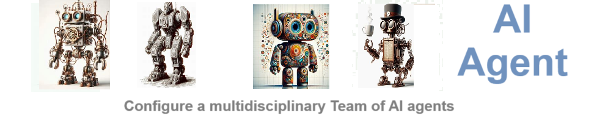
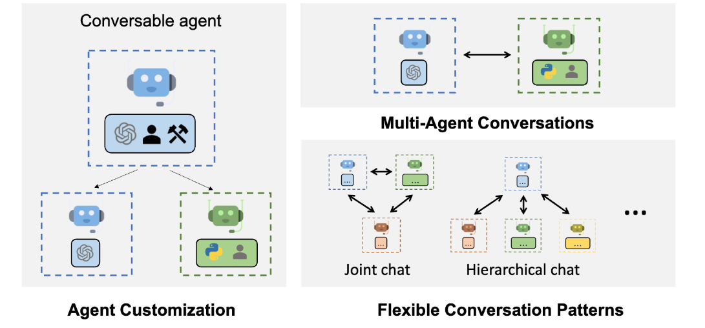
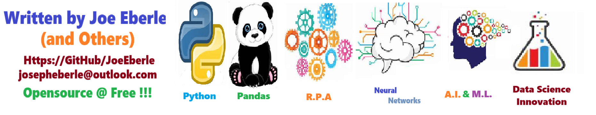

# Autogen - Use autogen AI agents to perform workflows and LLM integrations.
Use autogen AI agents to perform workflows and LLM integrations.

**AutoGen** is a framework designed to automate the process of creating and orchestrating multiple AI agents that collaborate to complete complex tasks. It leverages large language models (LLMs), like those used in natural language processing, and allows different agents to communicate, plan, and problem-solve together. Instead of relying on a single AI to perform an entire task, AutoGen sets up an ecosystem where multiple AI agents specialize in different aspects of the problem, working interactively to produce more accurate and complex outcomes.

AutoGen has the potential to **revolutionize AI** because it dramatically extends the capabilities of individual AI models by allowing them to work collaboratively and autonomously. This approach opens up possibilities for AI systems to tackle multifaceted challenges that require specialized knowledge across domains, enhancing efficiency and performance. Additionally, AutoGen can reduce the need for manual intervention, allowing AI agents to autonomously refine their workflows, improve decision-making, and generate solutions that were previously too complex for a single AI model to handle. This collaborative framework could be applied in various industries, including healthcare, finance, and logistics, paving the way for more sophisticated, self-sufficient AI ecosystems.

## Getting Started
To get started with the **Autogen** solution repository, follow these steps:
1. Clone the repository to your local machine.
2. Install the required dependencies listed at the top of the notebook.
3. Explore the example code provided in the repository and experiment.
4. Run the notebook and make it your own - **EASY !**
    
## Solution Features
- Easy to understand and use  
- Easily Configurable 
- Quickly start your project with pre-built templates
- Its Fast and Automated

## Notebook Features
- **Self Documenting** - Automatically identifes major steps in notebook 
- **Self Testing** - Unit Testing for each function
- **Easily Configurable** - Easily modify with **config.INI** - keyname value pairs
- **Includes Talking Code** - The code explains itself 
- **Self Logging** - Enhanced python standard logging   
- **Self Debugging** - Enhanced python standard debugging
- **Low Code** - or - No Code  - Most solutions are under 50 lines of code
- **Educational** - Includes educational dialogue and background material
    
## Deliverables or Figures
          
    

## Github    
## https://github.com/JoeEberle/ 

## Email 
## josepheberle@outlook.com 

    

    