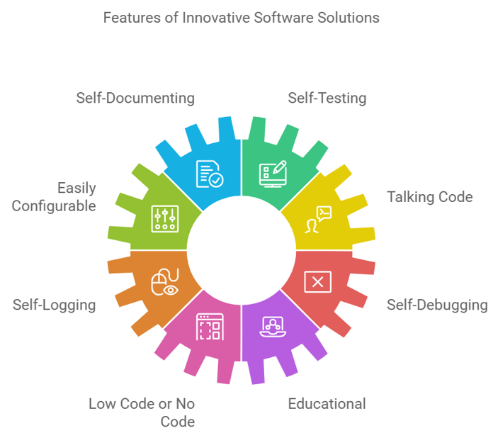
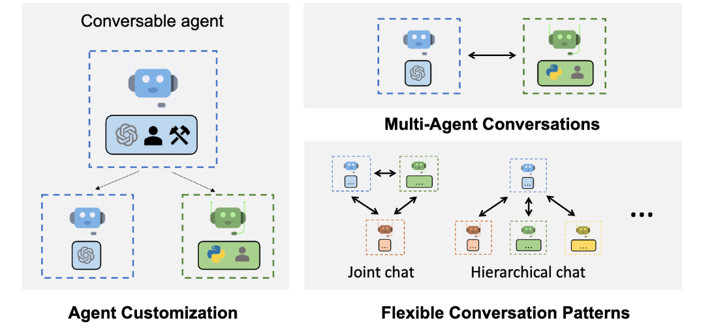

# Autogen - Use autogen AI agents to perform workflows and LLM integrations.
**AutoGen** is a framework designed to automate the process of creating and orchestrating multiple AI agents that collaborate to complete complex tasks. It leverages large language models (LLMs), like those used in natural language processing, and allows different agents to communicate, plan, and problem-solve together. Instead of relying on a single AI to perform an entire task, AutoGen sets up an ecosystem where multiple AI agents specialize in different aspects of the problem, working interactively to produce more accurate and complex outcomes.

AutoGen has the potential to **revolutionize AI** because it dramatically extends the capabilities of individual AI models by allowing them to work collaboratively and autonomously. This approach opens up possibilities for AI systems to tackle multifaceted challenges that require specialized knowledge across domains, enhancing efficiency and performance. Additionally, AutoGen can reduce the need for manual intervention, allowing AI agents to autonomously refine their workflows, improve decision-making, and generate solutions that were previously too complex for a single AI model to handle. This collaborative framework could be applied in various industries, including healthcare, finance, and logistics, paving the way for more sophisticated, self-sufficient AI ecosystems.


Here’s a **README.md** file for your **Autogen** project that introduces using autogen to create AI agents within a **Jupyter Notebook**:

---

# Autogen: Creating AI Agents in Jupyter Notebook

Welcome to the **Autogen** repository! This project provides a **Jupyter Notebook** that introduces the process of using **Autogen** to create and orchestrate multiple **AI agents**. These agents can work together autonomously to complete complex tasks using large language models (LLMs) like GPT, making the automation of workflows and decision-making processes easier and more efficient.

## Table of Contents
- [Introduction](#introduction)
- [Installation](#installation)
- [Usage](#usage)
- [Notebook Overview](#notebook-overview)
- [How Autogen Works](#how-autogen-works)
- [Contributing](#contributing)
- [License](#license)

## Introduction

**Autogen** is a framework designed to allow the creation and orchestration of multiple AI agents that work collaboratively on complex tasks. These agents can be specialized for different sub-tasks and communicate with each other, leveraging the power of large language models (LLMs) such as GPT, GPT-3, or other cutting-edge models.

This project provides an introductory **Jupyter Notebook** that demonstrates how to build and use AI agents via the **Autogen** framework, enabling a modular and efficient approach to handling AI workflows.

## Installation

To get started, clone the repository and install the required dependencies.

1. Clone the repository:

   ```bash
   git clone https://github.com/yourusername/autogen.git
   cd autogen
   ```

2. Install the dependencies using `pip`:

   ```bash
   pip install -r requirements.txt
   ```

### Requirements

- Python 3.7+
- Jupyter Notebook
- OpenAI API or other LLMs API access (if using external models)

## Usage

1. **Launch Jupyter Notebook**:
   - Navigate to the project folder and start Jupyter Notebook:
   
     ```bash
     jupyter notebook
     ```
   
2. **Open the Autogen Notebook**:
   - In Jupyter, open the file named `autogen_intro.ipynb`. This notebook will guide you through setting up and interacting with AI agents using the Autogen framework.

3. **Follow the Notebook Instructions**:
   - The notebook contains detailed instructions on creating, managing, and orchestrating AI agents. Each code cell includes explanations, and examples that showcase how Autogen works.

## Notebook Overview

The notebook is structured into sections that gradually introduce the concept of AI agents and demonstrate how to use Autogen to:

- Set up **multiple AI agents** with different tasks or roles.
- Enable **communication** and collaboration between AI agents to solve complex problems.
- Utilize **large language models** (LLMs) like GPT for natural language understanding and generation.
- Run **autonomous workflows** that reduce the need for human intervention.

## How Autogen Works

Autogen allows you to configure and automate AI agents that communicate with each other to break down and solve complex tasks. These agents can handle various activities such as:

- **Natural language processing (NLP)** tasks like question-answering, summarization, or text generation.
- **Decision-making workflows** that require back-and-forth communication between agents.
- **Complex task automation**, where agents manage sub-tasks and combine results for holistic problem-solving.

The agents can be tailored and extended to work on various domains, allowing you to build modular AI systems.

## Contributing

We welcome contributions to improve the Autogen project. To contribute:

1. Fork the repository.
2. Create a new branch (`git checkout -b feature-branch`).
3. Make your changes and commit them (`git commit -m 'Add new feature'`).
4. Push to the branch (`git push origin feature-branch`).
5. Open a pull request.

---

This **README.md** provides a clear overview of the project, instructions for getting started, and a breakdown of the notebook’s contents. It ensures users can quickly set up the environment and understand the purpose of Autogen within the Jupyter Notebook context.


## Getting Started

The goal of this solution is to **Jump Start** your development and have you up and running in 30 minutes. 

To get started with the **Autogen** solution repository, follow these steps:
1. Clone the repository to your local machine.
2. Install the required dependencies listed at the top of the notebook.
3. Explore the example code provided in the repository and experiment.
4. Run the notebook and make it your own - **EASY !**
    
## Notebook Features

These Features are design to provide everything you need for **Knowledge Transfer** 

- **Self Documenting** - Automatically identifes major steps in notebook 
- **Self Testing** - Unit Testing for each function
- **Easily Configurable** - Easily modify with **config.INI** - keyname value pairs
- **Includes Talking Code** - The code explains itself 
- **Self Logging** - Enhanced python standard logging   
- **Self Debugging** - Enhanced python standard debugging
- **Low Code** - or - No Code  - Most solutions are under 50 lines of code
- **Educational** - Includes educational dialogue and background material
    
## List of Figures
   <br>  <br>  <br>
    

## Github https://github.com/JoeEberle/ - Email  josepheberle@outlook.com 
    


    